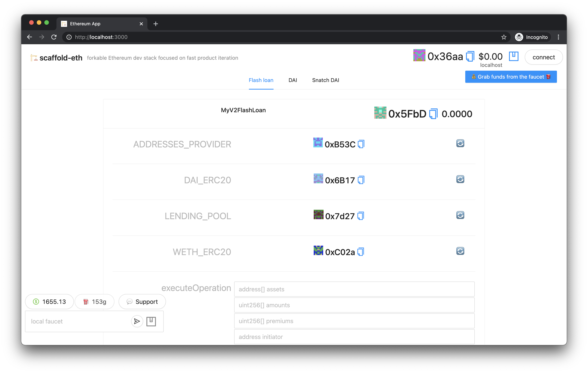
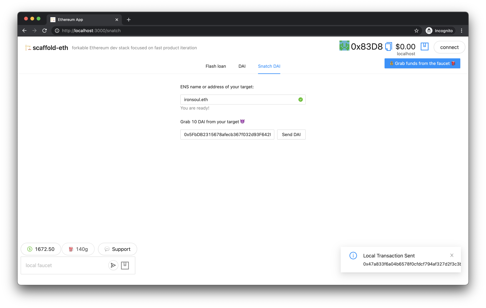
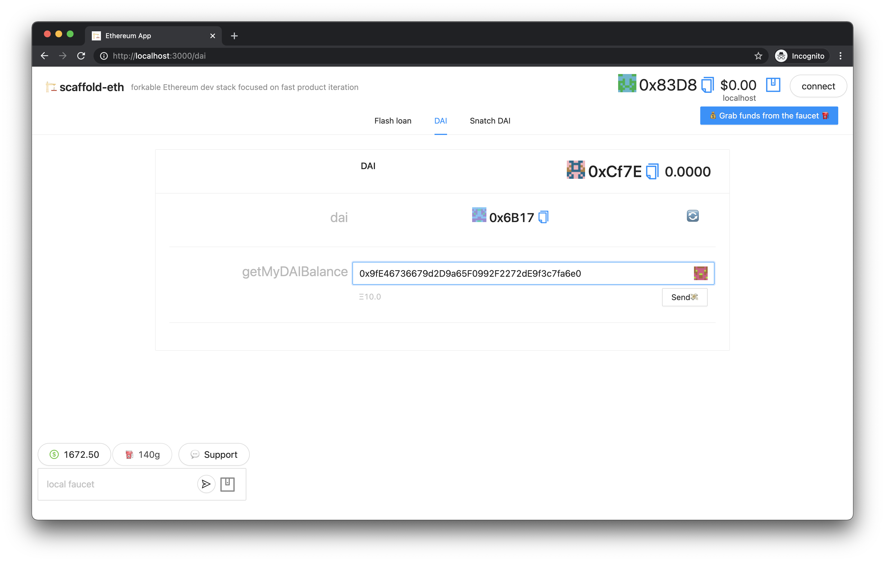
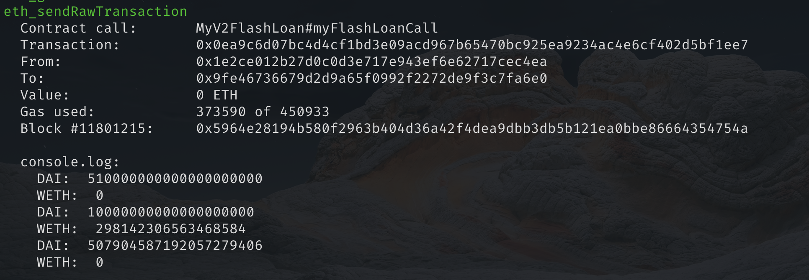
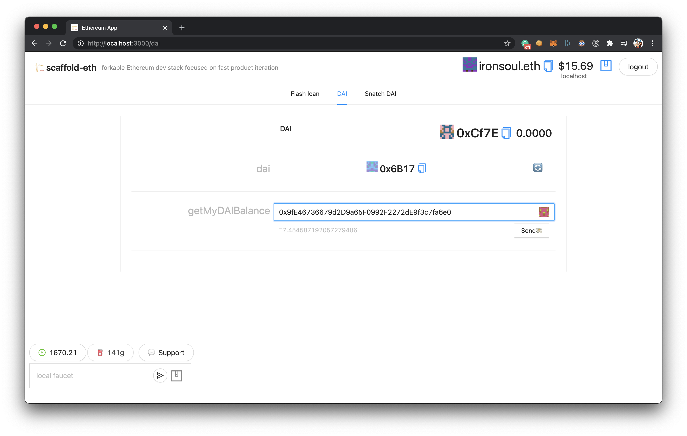

# 🏦🏗 scaffold-eth - Aave Flash Loans

> Learn how to borrow any available amount of assets without putting up any collateral and build a simple arbitrage bot that would trade between Uniswap and Sushiswap pools.

<details open="open">
  <summary>Table of Contents</summary>
  <ol>
    <li>
      <a href="#about-the-project">About The Project</a>
    </li>
    <li>
      <a href="#getting-started">Getting Started</a>
      <ul>
        <li><a href="#prerequisites">Prerequisites</a></li>
        <li><a href="#installation">Installation</a></li>
      </ul>
    </li>
    <li><a href="#smart-contracts">Exploring smart contracts</a></li>
    <li><a href="#arbitraging-flow">Arbitraging flow</a></li>
    <li><a href="#practice">Practice</a></li>
    <li><a href="#additional-resources">Additional resources</a></li>
    <li><a href="#contact">Contact</a></li>
  </ol>
</details>

## About The Project

DeFi is hot now. One of the reasons is an existence of features such as Flash Loans.

It is an uncollateralized debt. There is no equivalent in the real world. With Aave Protocol’s smart contracts, you can borrow any amount of Ethereum or ERC20 within your smart contract, if you pay it back by the end of the transaction, plus a small fee.

To do a Flash Loan, we will build a contract that requests a Flash Loan. The contract will then need to execute the instructed steps and pay back the loan + interest and fees all within the same transaction.

After requesting a flash loan, we will do some arbitrage trading by buying/selling two different ERC20 tokens with two different prices in two different exchanges.

## Getting Started

### Prerequisites

Please have a look at official docs by Aave. You can read them [here](https://docs.aave.com/faq/flash-loans) and [here](https://docs.aave.com/developers/guides/flash-loans).

Also, Infura has a great [blog post](https://blog.infura.io/build-a-flash-loan-arbitrage-bot-on-infura-part-i/) about building arbitrage bots.

### Installation

Let's start our environment for tinkering and exploring how flash loans work.

1. Clone the repo first
```sh
git clone -b flash-loans-intro https://github.com/austintgriffith/scaffold-eth.git flash-loans-intro
cd flash-loans-intro
```

2. Install dependencies
```bash
yarn install
```

3. Start your React frontend
```bash
yarn start
```

4. Fork mainnet and start your local blockhain using [Hardhat](https://hardhat.org/)
```bash
yarn fork
```

**This step is very important**. We will talk to real addresses of existing contracts on mainnet. Running local blockhain with `yarn chain` **will not work**!

Watch [this video](https://www.youtube.com/watch?v=xcBT4Jmi5TM&feature=youtu.be) to learn more about mainnet forking.

5. Deploy your smart contracts to a local blockchain
```bash
yarn deploy
```

<b>Pro Tip: </b> Use [tmux](https://linuxize.com/post/getting-started-with-tmux/) to easily start all commands in a single terminal window!

If everything worked fine, you have to have something like this opened in your browser:



## Smart contracts

Let's navigate to `packages/hardhat/contracts` folder and check out what contracts we have there.

We are only interested in 2 smart contracts: `MyV2FlashLoan.sol` and `DAI.sol`. All other contracts contain interfaces and constants for smooth development.

### MyV2FlashLoan.sol

The boilerplate for this contract is taken directly from [Aave docs](https://docs.aave.com/developers/guides/flash-loans). 

The most important thing is that we must conform to the `IFlashLoanReceiver` interface by implementing the relevant `executeOperation()` function.

That's why we inherit from `FlashLoanReceiverBase`, which conforms to the `IFlashLoanReceiver`.

```solidity
contract MyV2FlashLoan is FlashLoanReceiverBase
```

For our arbitrage bot, we will use two different ERC20 tokens: `DAI` and `WETH`. Also, we will trade using two different exhanges: `Uniswap` and `Sushiswap`. Sushiswap is just a fork of Uniswap. That's why they have absolutely identical Router interfaces.

In order to let us trade easily, let's instantiate routers for our exchanges in the contract and create IERC20 interfaces for our tokens.

```solidity
sushiswapRouter = IUniswapV2Router02(Constants.SUSHISWAP_ROUTER_ADDRESS);
uniswapRouter = IUniswapV2Router02(Constants.UNISWAP_ROUTER_ADDRESS);

DAI_ERC20 = IERC20(Constants.DAI_ADDRESS);
WETH_ERC20 = IERC20(Constants.WETH_ADDRESS);
```

If you are not familiar with Uniswap routers then you have to read [this](https://uniswap.org/docs/v2/smart-contracts/router02/) before continuing.

### DAI.sol

This contract is pretty simple and plays a helper role for us. All it does is checking how many DAI tokens some address has on its balance.

We will use it to check balance of our deployed contract to make sure we have some DAI beforehand to pay fees to Aave.

## Arbitraging flow

Firstly, let's define how much and what asset we will borrow from Aave. In our example, we will borrow `500 DAI`. However, you can choose any token and borrow any amount. Check out `loanSize` constant in our contract.

Core logic for arbitraging is located inside `executeOperation` function in `MyV2FlashLoan.sol` contract. This function will be executed right after we receive our requested assets - `500 DAI`.

Our first trade will swap all our requested DAI for WETH using Uniswap.

```solidity
DAI_ERC20.approve(Constants.UNISWAP_ROUTER_ADDRESS, loanSize);
uniswapRouter.swapExactTokensForTokens(loanSize, 0, path, address(this), block.timestamp + 5);
```

Our second trade will swap all our received WETH back to DAI using Sushiswap.

```solidity
WETH_ERC20.approve(Constants.SUSHISWAP_ROUTER_ADDRESS, WETHBalance);
sushiswapRouter.swapExactTokensForTokens(WETHBalance, 0, revPath, address(this), block.timestamp + 5);
```

In theory, if we make right calculations beforehand, we should benefit by doing these two trades.

At the end of the contract, we should make sure we approve tokens we requested from Aave and also additional fee.

```solidity
uint256 amountOwing = amounts[i].add(premiums[i]);
IERC20(assets[i]).approve(address(LENDING_POOL), amountOwing);
```

**Important**: In this contract we did not add any check whether we benefited from the trade or not. In real scenario, you `must` do this if you do not want to lose your money.

## Practice

If we do not benefit from our trade, our transaction will be reverted and we will be safe.

However, let's make our transaction happen even if do not benefit from our trade (just for fun and testing). In order to make this happen, we have to make sure our contract has some DAI beforehand. This DAI will be used to cover all our expenses including fee for Aave.

Firstly, copy address of your deployed smart contract `MyV2FlashLoan` and send it `10 DAI` using `Snatch` tab on your website.



Now if you check your contract's DAI balance using DAI tab, it should have 10 DAI available for you.



Excellent! Now let's try to run our `myFlashLoanCall` and watch what happens. After our transaction ends, let's check our DAI balance again. 

Once you press the button, it will take about 2-3 minutes for gas estimation. Just wait patiently.


Our metamask window then appears and we are ready to send our transaction!

You can also note some additional logging in our console that indicates how much WETH and DAI we have at some moment.



Not let's go back to our DAI tab and check how much DAI we have now. 



In my case, my balance went down by 2.6 DAI :(

This trade was not optimal and ideally we had to revert it. Obviously, you should do some research before arbitraging some tokens. For the sake of simplicity, we did not do these just to show how arbitraging works.

## Additional resources

* [Finematics explains Flash Loans](https://www.youtube.com/watch?v=mCJUhnXQ76s) - Nice theory explanation
* [Furucombo App](https://furucombo.app/) - Flash loans using drag and drop without coding (!)

## Contact

Join the [telegram support chat 💬](https://t.me/joinchat/KByvmRe5wkR-8F_zz6AjpA) to ask questions and find others building with 🏗 scaffold-eth!
