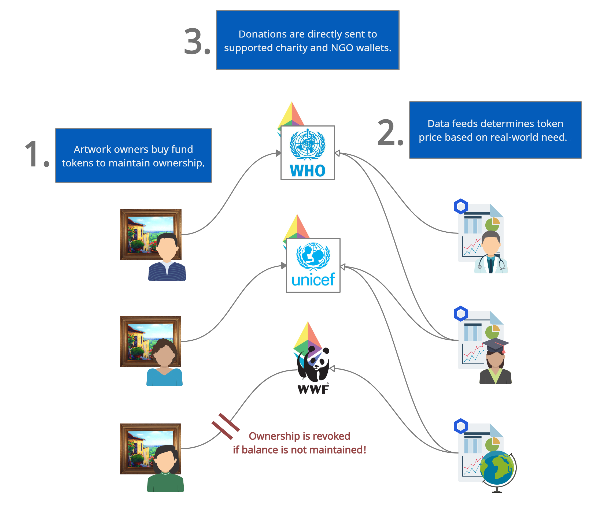
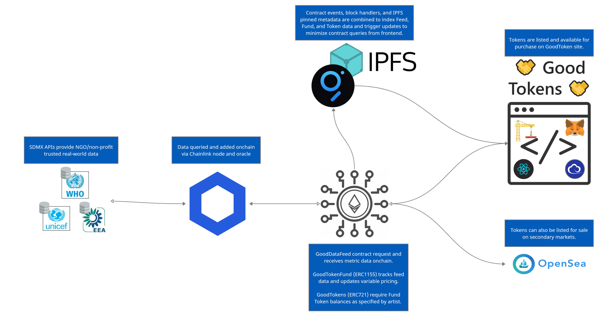

# [🤝 Good Tokens 🤝](https://good-tokens.surge.sh/)

## 💡 Concept

Good Tokens is a radical new model for art ownership that guarantees works of art support causes artists care about.

Rather than just a transactional asset that is bought once and held, Good Token NFTs require continuous contribution or engagement with a cause as a prerequisite for ownership. This rethinks the responsibilities of art ownership and creates a long-lasting relationship between the artist, art, owner, and supported organizations.

To maintain ownership, buyers must accumulate Good Token Funds donation tokens, the price of which track Good Token Feeds, NGO real-world data oracle indices.

Good Tokens rethinks the responsibilities of owning art. Is it enough to simply purchase an artwork and then own it forever, or should ownership be earned and maintained by supporting causes linked to the art or by participating in communities linked to the artist. This way, artworks can be more sustainable and the artist is assured their art aligns with their values.

 

## [Live Demo Here!](https://good-tokens.surge.sh/)
Please connect to the Rinkeby network! 

## Youtube video here

 

## 🔨 Contracts

The Good Tokens system consists of three main contracts, deployed to the Rinkeby testnet:
  - 📝 GoodToken  [[0xA508d9bf37baB3162894b4559c001e763537Bc77](https://rinkeby.etherscan.io/address/0xa508d9bf37bab3162894b4559c001e763537bc77)]
  - 📝 GoodTokenFund  [[0xd6a0ad998252274cD4568391743e62CC9Fa9568e](https://rinkeby.etherscan.io/address/0xd6a0ad998252274cD4568391743e62CC9Fa9568e)]
  - 📝 GoodDataFeed  [[0x6E293e996f4D40D66025A7520D7cCd037f93779c](https://rinkeby.etherscan.io/address/0x6E293e996f4D40D66025A7520D7cCd037f93779c)]
  - 🖇️ [Good Tokens Subgraph](https://thegraph.com/explorer/subgraph/jasperdegens/good-tokens)
  - 🌊 [OpenSea Marketplace](https://testnets.opensea.io/collection/goodtokens)

 
 

## Good Tokens Overview

 
 

## Technical Overview

 
 

## 🌐 UNICEF, EEA, SDMX Data Queries
Many NGOs and non-profit organizations use the SDMX protocol to provide their data to 3rd parties. Our [GoodDataFeed](https://rinkeby.etherscan.io/address/0x6E293e996f4D40D66025A7520D7cCd037f93779c) contract can register any open SDMX compatable data source and query data for a given year onchain via a [Chainlink oracle](https://rinkeby.etherscan.io/address/0x032887D0D0055e0f90447369F57EEb76b7a8e210) and node for transparent and trusted data. For our prototype, we selected [two data feeds](https://sdmx.data.unicef.org/databrowser/index.html) from UNICEF, one focused on immunizations and the other on out of school rates, and we also used a greenhouse gas emission metric from the [EEA](https://ec.europa.eu/eurostat/web/sdmx-infospace/welcome).

 
 

## [🖇️ The Graph + IPFS](https://thegraph.com/explorer/subgraph/jasperdegens/good-tokens)
We leveraged The Graph to bind together the data from our contracts and our metadata stored on IPFS.

Interesting tidbits:
  - Event Handlers for GoodToken, GoodTokenFund, and GoodDataFeed contracts.
  - Block Handler to query and update subgraph if tokens on our GoodToken contract were revoked.
  - IPFS cat calls to pull in pinned metadata for frontend magic.

We would have liked to use Call Handlers as well in order to cut down on gas costs, however at this time they are not supported on Rinkeby (we wanted to stick with Rinkeby to test [intergration with OpenSea](https://testnets.opensea.io/collection/goodtokens));

You can view our [hosted subgraph here](https://thegraph.com/explorer/subgraph/jasperdegens/good-tokens)!

 
 

## 🙏 Special thanks to:
- 🐦 Keenan and Patrick at Chainlink for amazing advice and support.
- Javier for hosting a Chainlink node on Rinkeby.
- Mehran at UNICEF for sharing the orgniazations inspiring vision for blockchain tech.
- The Graph for making block-chain querying an absolute pleasure.
- Austin Griffith for incredible scaffold code-base to get started with.
