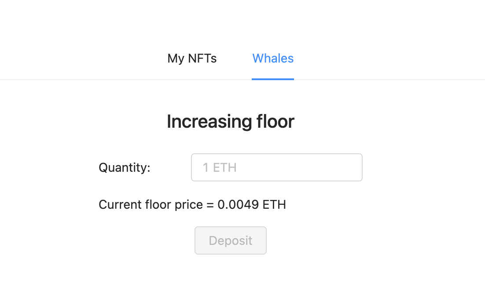

# 🏗 scaffold-eth - Retroactive Public Goods Funding Starter Kit

> Deploy an NFT sale that has a mechanism where whales can yolo ETH to the NFT contract to raise the floor!


[](https://youtu.be/q0CBVeagpyg)

[https://youtu.be/q0CBVeagpyg](https://youtu.be/q0CBVeagpyg)


## 🏃‍♀️ Quick Start

required: [Node](https://nodejs.org/dist/latest-v12.x/) plus [Yarn](https://classic.yarnpkg.com/en/docs/install/) and [Git](https://git-scm.com/downloads)


1. Clone the repo first
```sh
git clone -b nft-retroactive-funding https://github.com/austintgriffith/scaffold-eth.git nft-retroactive-funding
cd nft-retroactive-funding
```

2. Install dependencies
```bash
yarn install
```

3. Spin up local chain
```sh
yarn chain
```

4. Deploy Contracts
```sh
yarn deploy
```

5. Start React frontend
```bash
yarn start
```

## Introduction

Mint an NFT with a price curve to raise a small amount of funding to a multisig. 

Then, a whale can yolo ETH to the NFT contract to allow NFT holders to redeem for a floor price.

The floor price is equal to the amount of ETH in the contract divided by the number of NFTs in circulation.

## UI

The first screen allows the user to mint NFTs and burn them. Burning happens at the floor price and user gets some ETH for this.


The second screen is intended for whales who can "raise the floor" by depositing some ETH into the contract.



## Contact

Join the [telegram support chat 💬](https://t.me/joinchat/KByvmRe5wkR-8F_zz6AjpA) to ask questions and find others building with 🏗 scaffold-eth!


