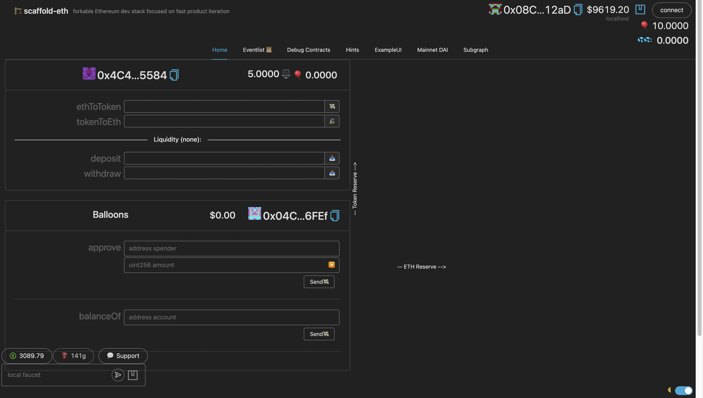
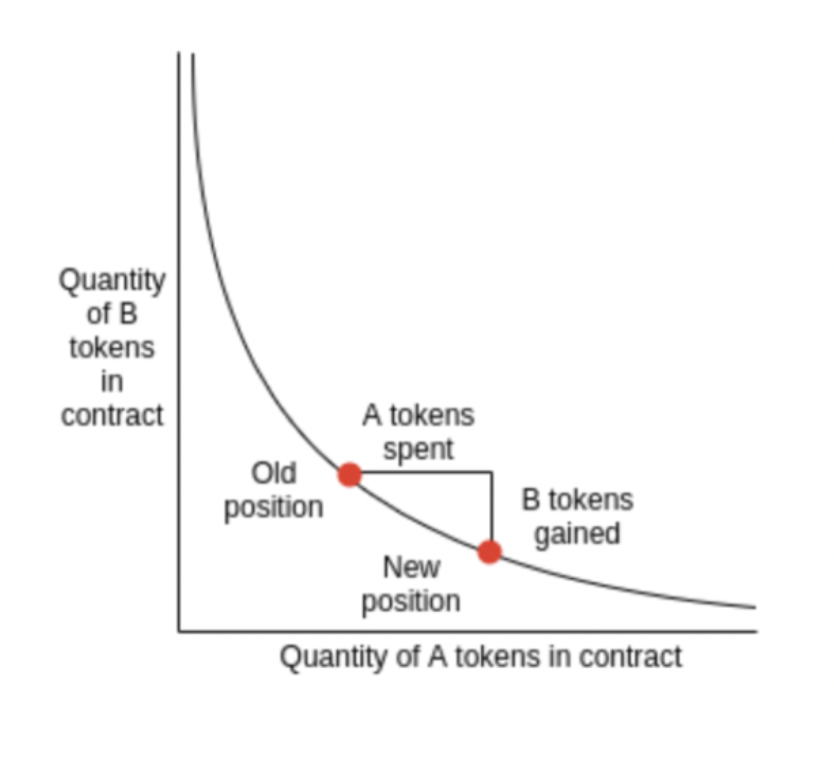
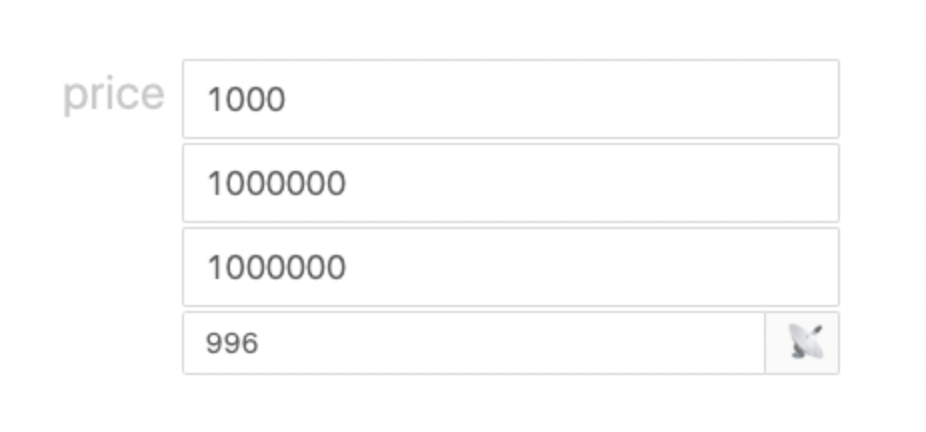
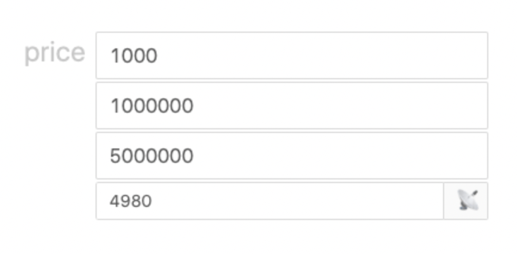
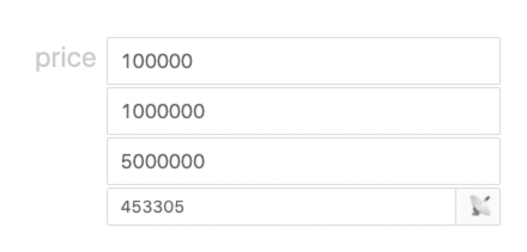
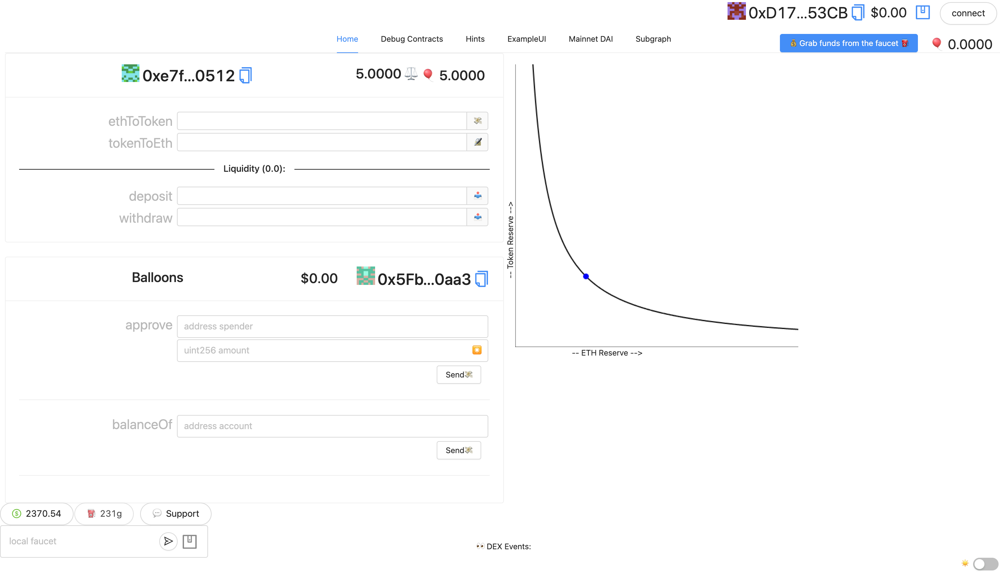

# 🏗 scaffold-eth | 🏰 BuidlGuidl

## 🚩 **Challenge 3: Minimum Viable Exchange**

This challenge will help you build/understand a simple decentralized exchange, with one token-pair (ERC20 BALLOONS ($BAL) and ETH). This repo is an updated version of the [original tutorial](https://medium.com/@austin_48503/%EF%B8%8F-minimum-viable-exchange-d84f30bd0c90) and challenge repos before it. Please read the intro for a background on what we are building first!

**There is a `DEXTemplate.sol` file for your use if you want (rename it to `DEX.sol`). As well, this repo has solutions (👮🏻 try not to peak!) in it (in root directory, there's a solutions sub-directory) for now, but the challenge is to write the smart contracts yourself of course!**

> ❗️ NOTE: functions outlined within the `DEXTemplate.sol` are what works with the front end of this branch/repo. Also return variable names may need to be specified exactly as outlined within the `Solutions/DEX.sol` file. If you are confused, see solutions folder in this repo and/or cross reference with front-end code.

There is also a [Youtube video](https://www.youtube.com/watch?v=eP5w6Ger1EQ&t=364s&ab_channel=SimplyExplained) that may help you understand the concepts covered within this challenge too:

This branch was heavily based off of this [archived feature branch](https://github.com/scaffold-eth/scaffold-eth-challenges/tree/challenge-5-dex).

---

### **⛳️ Checkpoint 0: 📦 install 📚**

Pull down the appropriate challenge repo/branch to get started.

> ❗️ NOTE: The current front-end may need to be refreshed as you carry out transactions to update your balance of balloons in the UI, etc.

```bash
git clone https://github.com/squirtleDevs/scaffold-eth.git challenge-3-single-pool-dex
cd scaffold-eth
git checkout challenge-3-single-pool-dex
yarn install
```

---

### ⛳️ **Checkpoint 1: 🔭 Environment 📺**

You'll have three terminals up for:

`yarn start` (react app frontend)

`yarn chain` (hardhat backend)

`yarn deploy` (to compile, deploy, and publish your contracts to the frontend)

Navigate to the Debug Contracts tab and you should see two smart contracts displayed called `DEX` and `Balloons`.

> 👩‍💻 Rerun `yarn deploy` whenever you want to deploy new contracts to the frontend (run `yarn deploy --reset` for a completely fresh deploy if you have made no contract changes).

`Balloons.sol` is just an example ERC20 contract that mints 1000 $BAL to whatever address deploys it.
`DEX.sol` is what we will build in this challenge and you can see it starts with a SafeMath library to help us prevent overflows and underflows and also tracks a token (ERC20 interface) that we set in the constructor (on deploy).

> Below is what your front-end will look like with no implementation code within your smart contracts yet. The buttons will likely break because there are no functions tied to them yet!

> **⭐️ Also note that there is no curve until you uncomment the specific lines of code at the end of `00_deploy_your_contract.js`**.

<p align="center">
  
</p>

> 🎉 You've made it this far in Scaffold-Eth Challenges 👏🏼 . As things get more complex, it might be good to review the design requirements of the challenge first! Check out the empty DEXTemplate.sol file to see aspects of each function. If you can explain how each function will work with one another, that's great! 😎

> 🚨 🚨 🦖 **The code blobs within the toggles are some examples of what you can use, but try writing the implementation code for the functions first!**

---

### ⛳️ **Checkpoint 2: Reserves** 🪙 ⚖️

We want to create an automatic market where our contract will hold reserves of both ETH and 🎈 Balloons. These reserves will provide liquidity that allows anyone to swap between the assets.

Add a couple new variables to `DEX.sol` for `totalLiquidity` and `liquidity`:

<details markdown='1'><summary>👩🏽‍🏫 Solution Code</summary>

```
uint256 public totalLiquidity;
mapping (address => uint256) public liquidity;
```

</details>

These variables track the total liquidity, but also by individual addresses too.
Now, let's create an `init()` function in `DEX.sol` that is payable and then we can define an amount of tokens that it will transfer to itself.

<details markdown='1'><summary> 👨🏻‍🏫 Solution Code</summary>

```
    function init(uint256 tokens) public payable returns (uint256) {
        require(totalLiquidity == 0, "DEX: init - already has liquidity");
        totalLiquidity = address(this).balance;
        liquidity[msg.sender] = totalLiquidity;
        require(token.transferFrom(msg.sender, address(this), tokens), "DEX: init - transfer did not transact");
        return totalLiquidity;
    }
```

</details>

Calling `init()` will load our contract up with both ETH and 🎈 Balloons.

We can see that the DEX starts empty. We want to be able to call `init()` to start it off with liquidity, but we don’t have any funds or tokens yet. Add some ETH to your local account using the faucet and then find the `00_deploy_your_contract.js` file. Find and uncomment the line below and add your front-end address:

```
  // // paste in your front-end address here to get 10 balloons on deploy:
  // await balloons.transfer(
  //   "0xe64bAAA0F6012A0F320a262cFe39289bA6cBd0f2",
  //   "" + 10 * 10 ** 18
  // );
```

Run `yarn deploy`. The front end should show you that you have balloon tokens. We can’t just call `init()` yet because the DEX contract isn’t allowed to transfer tokens from our account. We need to `approve()` the DEX contract with the Balloons UI.

🤓 Copy and paste the DEX address and then set the amount to 5000000000000000000 (5 _ 10¹⁸). You can confirm this worked using the `allowance()` function. Now we are ready to call `init()` on the DEX. We will tell it to take (5 _ 10¹⁸) of our tokens and we will also send 0.01 ETH with the transaction. You can see the DEX contract's value update and you can check the DEX token balance using the balanceOf function on the Balloons UI.

This works pretty well, but it will be a lot easier if we just call the `init()` function as we deploy the contract. In the `00_deploy_your_contract.js` script try uncommenting the init section so our DEX will start with 5 ETH and 5 Balloons of liquidity:

```
  // // uncomment to init DEX on deploy:
  // console.log(
  //   "Approving DEX (" + dex.address + ") to take Balloons from main account..."
  // );
  // // If you are going to the testnet make sure your deployer account has enough ETH
  // await balloons.approve(dex.address, ethers.utils.parseEther("100"));
  // console.log("INIT exchange...");
  // await dex.init(ethers.utils.parseEther("5"), {
  //   value: ethers.utils.parseEther("5"),
  //   gasLimit: 200000,
  // });
```

Now when we `yarn deploy --reset` then our contract should be initialized as soon as it deploys and we should have equal reserves of ETH and tokens.

### 🥅 Goals / Checks

- [ ] 🎈 Under the debug tab, does your DEX show 5 ETH and 5 Balloons of liquidity?

---

### ⛳️ **Checkpoint 3: Price** 🤑

This section is directly from the [original tutorial](https://medium.com/@austin_48503/%EF%B8%8F-minimum-viable-exchange-d84f30bd0c90) "Price" section. It outlines the general details of the DEX's pricing model.

Now that our contract holds reserves of both ETH and tokens, we want to use a simple formula to determine the exchange rate between the two.
Let’s start with the formula `x * y = k` where `x` and `y` are the reserves:

```
(amount of ETH in DEX ) * ( amount of tokens in DEX ) = k
```

The `k` is called an invariant because it doesn’t change during trades. (The `k` only changes as liquidity is added.) If we plot this formula, we’ll get a curve that looks something like:

<p align="center">
  
</p>

> 💡 We are just swapping one asset for another, the “price” is basically how much of the resulting output asset you will get if you put in a certain amount of the input asset.

🤔 OH! A market based on a curve like this will always have liquidity, but as the ratio becomes more and more unbalanced, you will get less and less of the less-liquid asset from the same trade amount. Again, if the smart contract has too much ETH and not enough $BAL tokens, the price to swap $BAL tokens to ETH should be more desirable.

When we call `init()` we passed in ETH and $BAL tokens at a ratio of 1:1. As the reserves of one asset changes, the other asset must also change inversely in order to maintain the constant product formula (invariant k).

Now, try to edit your DEX.sol smart contract and bring in a price function!

<details markdown='1'><summary>👩🏽‍🏫 Solution Code</summary>

```

    function price(
        uint256 xInput,
        uint256 xReserves,
        uint256 yReserves
    ) public view returns (uint256 yOutput) {
        uint256 xInputWithFee = xInput.mul(997);
        uint256 numerator = xInputWithFee.mul(yReserves);
        uint256 denominator = (xReserves.mul(1000)).add(xInputWithFee);
        return (numerator / denominator);
    }

```

</details>

We use the ratio of the input vs output reserve to calculate the price to swap either asset for the other. Let’s deploy this and poke around:

```
yarn run deploy
```

Let’s say we have 1 million ETH and 1 million tokens, if we put this into our price formula and ask it the price of 1000 ETH it will be an almost 1:1 ratio:

<p align="center">
  
</p>

If we put in 1000 ETH we will receive 996 tokens. If we’re paying a 0.3% fee it should be 997 if everything was perfect. BUT, there is a tiny bit of slippage as our contract moves away from the original ratio. Let’s dig in more to really understand what is going on here.
Let’s say there is 5 million ETH and only 1 million tokens. Then, we want to put 1000 tokens in. That means we should receive about 5000 ETH:

<p align="center">
  
</p>

Finally, let’s say the ratio is the same but we want to swap 100,000 tokens instead of just 1000. We’ll notice that the amount of slippage is much bigger. Instead of 498,000 back we will only get 453,305 because we are making such a big dent in the reserves.

<p align="center">
  
</p>

❗️ The contract automatically adjusts the price as the ratio of reserves shifts away from the equilibrium. It’s called an 🤖 _Automated Market Maker (AMM)._

### 🥅 Goals / Checks

- [ ] 🤔 Do you understand how the x\*y=k price curve actually works? Write down a clear explanation for yourself and derive the formula for price. You might have to shake off some old algebra skills!
- [ ] 💃 You should be able to go through the price section of this tutorial with the sample numbers and generate the same outputChange variable.

> 💡 _Hints:_ See this [link](https://hackernoon.com/formulas-of-uniswap-a-deep-dive), solve for the change in the Output Reserve. See the section in that link up to the uniswap v3 title.

> 💡💡 _More Hints:_ Also, don't forget to think about how to implement the trading fee. Solidity doesn't allow for decimals, so one way that contracts are written to implement percentage is using whole uints (997 and 1000) as numerator and denominator factors, respectively.

---

### ⛳️ **Checkpoint 4: Trading** 🤝

Let’s edit the DEX.sol smart contract and add two new functions for swapping from each asset to the other, `ethToToken()` and `tokenToEth()`!

<details markdown='1'><summary>👨🏻‍🏫 Solution Code </summary>

```
    /**
     * @notice sends Ether to DEX in exchange for $BAL
     */
    function ethToToken() public payable returns (uint256 tokenOutput) {
        require(msg.value > 0, "cannot swap 0 ETH");
        uint256 ethReserve = address(this).balance.sub(msg.value);
        uint256 token_reserve = token.balanceOf(address(this));
        uint256 tokenOutput = price(msg.value, ethReserve, token_reserve);

        require(token.transfer(msg.sender, tokenOutput), "ethToToken(): reverted swap.");
        emit EthToTokenSwap(msg.sender, "Eth to Balloons", msg.value, tokenOutput);
        return tokenOutput;
    }

    /**
     * @notice sends $BAL tokens to DEX in exchange for Ether
     */
    function tokenToEth(uint256 tokenInput) public returns (uint256 ethOutput) {
        require(tokenInput > 0, "cannot swap 0 tokens");
        uint256 token_reserve = token.balanceOf(address(this));
        uint256 ethOutput = price(tokenInput, token_reserve, address(this).balance);
        require(token.transferFrom(msg.sender, address(this), tokenInput), "tokenToEth(): reverted swap.");
        (bool sent, ) = msg.sender.call{ value: ethOutput }("");
        require(sent, "tokenToEth: revert in transferring eth to you!");
        emit TokenToEthSwap(msg.sender, "Balloons to ETH", ethOutput, tokenInput);
        return ethOutput;
    }
```

</details>

> 💡 Each of these functions should calculate the resulting amount of output asset using our price function that looks at the ratio of the reserves vs the input asset. We can call tokenToEth and it will take our tokens and send us ETH or we can call ethToToken with some ETH in the transaction and it will send us $BAL tokens. Deploy it and try it out!

---

### ⛳️ **Checkpoint 5: Liquidity** 🌊

So far, only the `init()` function controls liquidity. To make this more decentralized, it would be better if anyone could add to the liquidity pool by sending the DEX both ETH and tokens at the correct ratio.

Let’s create two new functions that let us deposit and withdraw liquidity. How would you write this function out? Try before taking a peak!

> 💡 _Hints:_
> The `deposit()` function receives ETH and also transfers $BAL tokens from the caller to the contract at the right ratio. The contract also tracks the amount of liquidity (how many liquidity provider tokens (LPTs) minted) the depositing address owns vs the totalLiquidity.

> 💡💡 _More Hints:_ The `withdraw()` function lets a user take both ETH and $BAL tokens out at the correct ratio. The actual amount of ETH and tokens a liquidity provider withdraws could be higher than what they deposited because of the 0.3% fees collected from each trade. It also could be lower depending on the price fluctuations of $BAL to ETH and vice versa (from token swaps taking place using your AMM!). The 0.3% fee incentivizes third parties to provide liquidity, but they must be cautious of [Impermanent Loss (IL)](https://www.youtube.com/watch?v=8XJ1MSTEuU0&t=2s&ab_channel=Finematics).

<details markdown='1'><summary>👩🏽‍🏫 Solution Code </summary>

```
    function deposit() public payable returns (uint256 tokensDeposited) {
        uint256 ethReserve = address(this).balance.sub(msg.value);
        uint256 tokenReserve = token.balanceOf(address(this));
        uint256 tokenDeposit;

        tokenDeposit = (msg.value.mul(tokenReserve) / ethReserve).add(1);
        uint256 liquidityMinted = msg.value.mul(totalLiquidity) / ethReserve;
        liquidity[msg.sender] = liquidity[msg.sender].add(liquidityMinted);
        totalLiquidity = totalLiquidity.add(liquidityMinted);

        require(token.transferFrom(msg.sender, address(this), tokenDeposit));
        emit LiquidityProvided(msg.sender, liquidityMinted, msg.value, tokenDeposit);
        return tokenDeposit;
    }

    function withdraw(uint256 amount) public returns (uint256 eth_amount, uint256 token_amount) {
        require(liquidity[msg.sender] >= amount, "withdraw: sender does not have enough liquidity to withdraw.");
        uint256 ethReserve = address(this).balance;
        uint256 tokenReserve = token.balanceOf(address(this));
        uint256 ethWithdrawn;

        ethWithdrawn = amount.mul(ethReserve) / totalLiquidity;

        uint256 tokenAmount = amount.mul(tokenReserve) / totalLiquidity;
        liquidity[msg.sender] = liquidity[msg.sender].sub(amount);
        totalLiquidity = totalLiquidity.sub(amount);
        (bool sent, ) = payable(msg.sender).call{ value: ethWithdrawn }("");
        require(sent, "withdraw(): revert in transferring eth to you!");
        require(token.transfer(msg.sender, tokenAmount));
        emit LiquidityRemoved(msg.sender, amount, ethWithdrawn, tokenAmount);
        return (ethWithdrawn, tokenAmount);
    }

```

 </details>

Remember that you will need to call `approve()` from the `Balloons.sol` contract approving the DEX to handle a specific number of your $BAL tokens. To keep things simple, you can just do that when interacting with the UI or debug tab with your contract.

🚨 Take a second to understand what these functions are doing if you pasted them into your DEX.sol file in packages/hardhat/contracts:

### 🥅 Goals / Checks

- [ ] 💧 Deposit liquidity, and then check your liquidity amount through the mapping in the debug tab. Has it changed properly? Did the right amount of assets get deposited?
- [ ] 🧐 What happens if you `deposit()` at the beginning of the deployed contract, then another user starts swapping out for most of the balloons, and then you try to withdraw your position as a liquidity provider? Answer: you should get the amount of liquidity proportional to the ratio of assets within the isolated liquidity pool. It will not be 1:1.

---

### ⛳️ **Checkpoint 6: UI** 🖼

Cool beans! Your front-end should be showing something like this now!

<p align="center">
  
</p>

Now, a user can just enter the amount of ETH or tokens they want to swap and the chart will display how the price is calculated. The user can also visualize how larger swaps result in more slippage and less output asset.

### 🥅 Extra Challenge:

- [ ] `approve()` event emission: can you implement this into the event tabs so that it is clear when `approve()` from the `Balloons.sol` contract has been executed?

### **Checkpoint 7: 💾 Deploy it!** 🛰

📡 Edit the `defaultNetwork` in `packages/hardhat/hardhat.config.js`, as well as `targetNetwork` in `packages/react-app/src/App.jsx`, to [your choice of public EVM networks](https://ethereum.org/en/developers/docs/networks/)

### 🔶 Infura

> You will need to get a key from infura.io and paste it into constants.js in packages/react-app/src:


👩‍🚀 You will want to run `yarn account` to see if you have a **deployer address**

🔐 If you don't have one, run `yarn generate` to create a mnemonic and save it locally for deploying.

🛰 Use an [instantwallet.io](https://instantwallet.io) to fund your **deployer address** (run `yarn account` again to view balances)

> 🚀 Run `yarn deploy` to deploy to your public network of choice (😅 wherever you can get ⛽️ gas)

🔬 Inspect the block explorer for the network you deployed to... make sure your contract is there.

👮 Your token contract source needs to be **verified**... (source code publicly available on the block explorer)

---

### **Checkpoint 8: 📜 Contract Verification**

Update the api-key in packages/hardhat/package.json file. You can get your key [here](https://etherscan.io/myapikey).


> Now you are ready to run the `yarn verify --network your_network` command to verify your contracts on etherscan 🛰

This will be the URL you submit to [SpeedRun](https://speedrunethereum.com).

---

### **Checkpoint 9: 🚢 Ship it! 🚁**

📦 Run `yarn build` to package up your frontend.

💽 Upload your app to surge with `yarn surge` (you could also `yarn s3` or maybe even `yarn ipfs`?)

🚔 Traffic to your url might break the [Infura](https://infura.io/) rate limit, edit your key: `constants.js` in `packages/ract-app/src`.

---

> 💬 Problems, questions, comments on the stack? Post them to the [🏗 scaffold-eth developers chat](https://t.me/joinchat/F7nCRK3kI93PoCOk)

---
