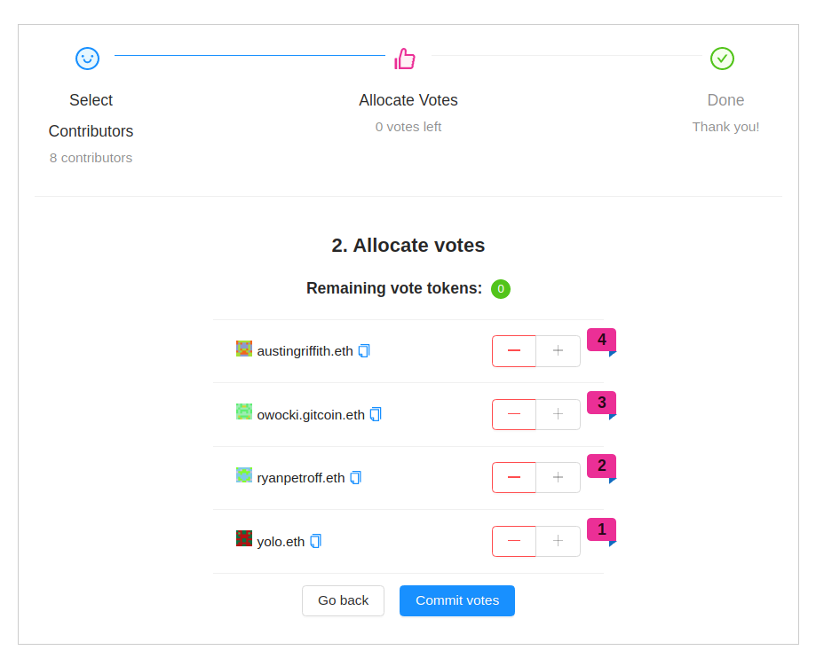

# Quadratic diplomacy (distribution creation and votes off-chain)

A semi-decentralized & effective way of distributing rewards to workstream contributors.



This build uses a Firebase data store for storing members and votes. The distribution creation and the votes are verified using signed messages. Then the distribution is done on-chain based on the information from the off-chain distribution.

Built with [🏗 Scaffold-ETH](https://github.com/austintgriffith/scaffold-eth) as a [Moonshot collective](https://moonshotcollective.space/) project.

## 🏄‍♂️ Quick start

Prerequisites: [Node](https://nodejs.org/en/download/) plus [Yarn](https://classic.yarnpkg.com/en/docs/install/) and [Git](https://git-scm.com/downloads)

#### 1. Clone repository

```bash
git clone -b qd-off-chain https://github.com/scaffold-eth/scaffold-eth.git qd-off-chain
```

#### 2. Install and start your 👷‍ Hardhat chain:

```bash
cd qd-off-chain
yarn install
yarn chain
```

#### 3. In a second terminal window, start your 📱 frontend:

```bash
cd qd-off-chain
yarn start
```

Copy your local burner wallet address (top right)

#### 4. Deploy your contract:

In `packages/hardhat/deploy/00_deploy_your_contract.js` paste your wallet address:

```js
const TO_ADDRESS = "YOUR_FRONTEND_ADDRESS";
```

You can also tweak the script (add test data, etc)

In a third terminal window, run:

```bash
cd qd-off-chain
yarn deploy
```

#### 5. Run backend:

In a fourth terminal window, run the backend:

The project uses a local json file store as default.

You can switch to a Firebase (Firestore) data storage editing ```packages/backend/services/db.js```. You'll need to create a firebase project and download the service account key configuration in your computer and set an environment variable with the path to that file (```export GOOGLE_APPLICATION_CREDENTIALS="pathToServiceAccountKeyFile"```). You can generate and donwload the file in https://console.cloud.google.com/, under IAM & Admin > Service Accounts > Keys.

```bash
cd qd-off-chain
yarn backend
```

📱 Open http://localhost:3000 to see the app

## 📚 Documentation

Documentation, tutorials, challenges, and many more resources, visit: [docs.scaffoldeth.io](https://docs.scaffoldeth.io)
