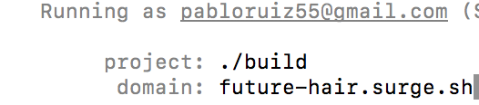
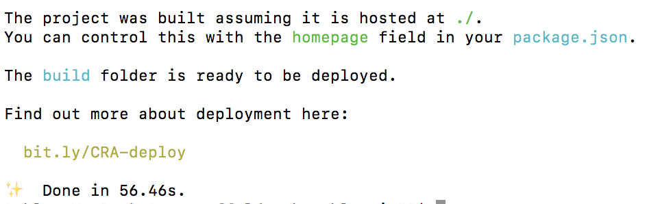
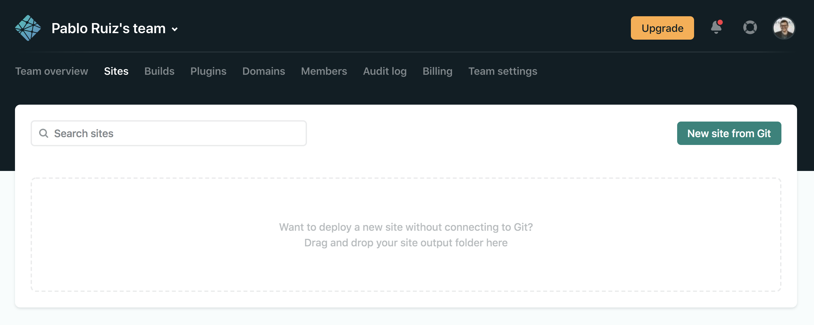
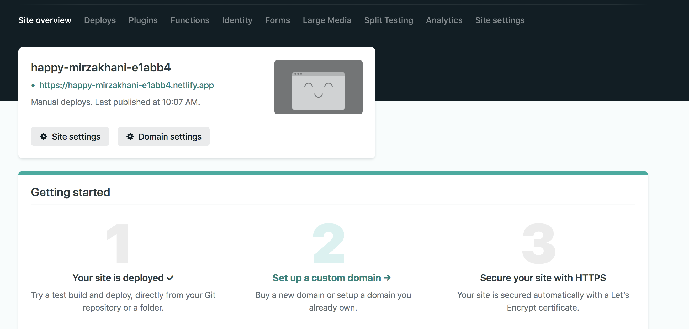
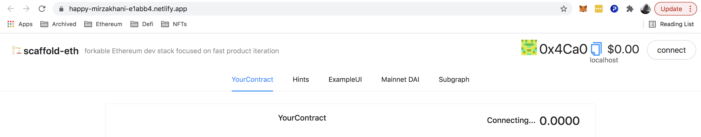
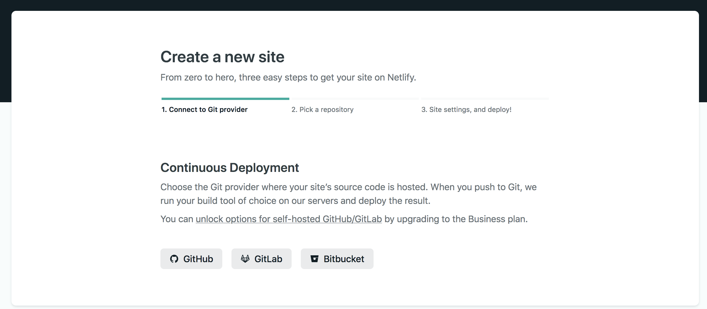
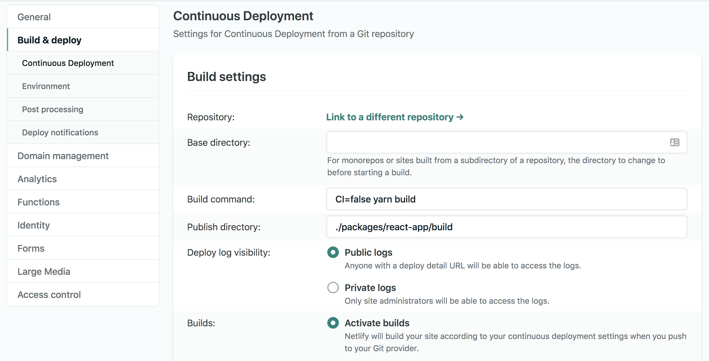
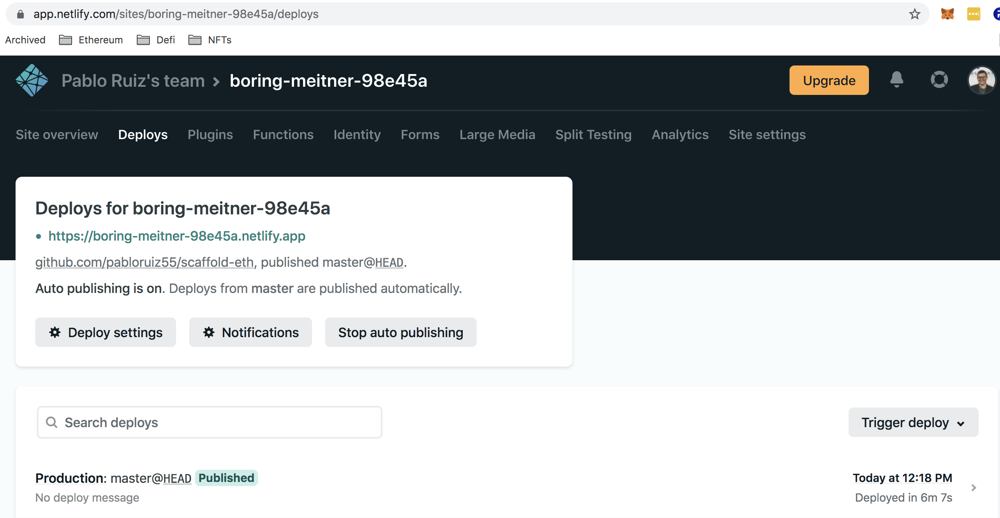

# Shipping your App

Shipping you app is very easy with Scaffold-eth.   
You can do it from the command-line with any of these services:

* Surge
* S3
* IPFS

```text
# package up the static site:
yarn build

# ship it!
yarn surge

OR

yarn s3

OR

yarn ipfs
```

## Preparing your App

Before building your app and shipping it there's a few things you should review to make sure it works as intended.

1. Deploy your contracts to the intended network\(s\). This will generate the contract artifacts for your app to consume. Refer to [this guide](../solidity/deploying-your-contracts.md) for instructions on how to deploy your contracts with Hardhat deploy.
2. Verify your contracts on Etherscan. People are \(rightly\) afraid of interacting with an app whose smart contracts' code is not visible. Refer to [this guide](../infraestructure/etherscan.md) on how to streamline this process with Scaffoldd-eth
3. Turn **Debug mode** off to stop printing logs. In line 48 of app.jsx `const DEBUG = false;`
4. Review `app.jsx` and remove any extra code you are not using. Scaffold-eth comes with many examples on how to subscribe to blocks, fetch gas prices, eth prices, etc. which you might not use but are still making rpc calls to your node.
5. Make sure the React app is pointing to the selected network. By default Scaffold-eth is set up so the app forces which network it's pointing to. Review _line 45_ of `app.jsx` and change the `targetNetwork` accordingly.
6. Make sure you are using your own nodes and not the ones in Scaffold-eth as they are public and there's no guarantee they will be taken down or rate limited. Review lines 58 and 59 of `app.jsx`.
7. Review the `constants.js` file and swap the services' API keys with yours. You need to create an account on **Infura**, **Etherscan** and **Blocknative** if you want to use their services.

Once you are done with these suggested steps, you can build and ship your app as follows:

```text
#Surge example
cd scaffold-eth
yarn build
yarn surge
```

## Deploying to Surge Step by Step

Deploying with Surge is very simple. The first time you do it, though, you will be asked to provide an email and then confirm your account. Once you've done that, run the follwing commands:

```text
#First, build the app
yarn build

#Then, deploy to Surge
yarn surge
```

You should see the following prompt:



You can change the domain you'd like to use for your app or just press enter to leave it as randomly generated. After the upload is successful, you should be able to access the site at the domain you chose. _\(Note: If you pick a domain that is already taken you will be prompted to change it\)_

## Deploying to Netlify Step by Step

Of course, you can also take your build folder and use it to ship your app through other services Scaffold-eth doesn't currently support from the command-line. Here's a step-by-step guide on how to do it on Netlify.

### Drag & Drop on the Netlify site

#### **Step 1:  Setup**

Make sure your build is properly configured as explained in this page above. ****Then, run the following command to build your app:

```text
cd scaffold-eth
yarn build
```

If successful, you should see something like this:



You should now have a `build` folder in `/packages/react-app`. 

#### Step 2: Deployment

Log into your Netlify account and head over the `Sites` tab



Drag and drop the previously generated `build` folder into the browser. You should see something like this after it's finished uploading:



#### Step 3: Configure and test

Once the app has been built on Netlify, you can continue configuring it, setting up HTTPS, assigning a custom domain and more. On the top-left side of the screen you can see the url to which your app has been deployed. Click on it to open it in a new tab. You should now see your app in there:



### Deploying with Netlify-cli

#### Step 1: Setup Netlify-cli

```text
cd scaffold-eth

# Install Netlify CLI globally
npm install netlify-cli -g

netlify login
#You will be prompted to enter your Netlify credentials

```

Read this article for more installation options: [https://www.netlify.com/blog/2019/05/28/deploy-in-seconds-with-netlify-cli/](https://www.netlify.com/blog/2019/05/28/deploy-in-seconds-with-netlify-cli/)

#### Step 2: Build your app

```text
cd scaffold-eth
yarn build
```

#### Step 3: Deploy your app

```text
netlify deploy -p
```

Follow the console prompts. Note that when asked for the `Deploy Path` you should enter the folder where your build was generated, which by default should be **`/packages/react-app/build`**

Once it's done uploading, you should see something like this: 

```text
✔ Finished hashing 23 files
✔ CDN requesting 6 files
✔ Finished uploading 6 assets
✔ Deploy is live!

Logs:              https://app.netlify.com/sites/amazing-mcclintock-94e953/deploys/60d9e4f21445a8b4c095c04f
Unique Deploy URL: https://60d9e4f21445a8b4c095c04f--amazing-mcclintock-94e953.netlify.app
Website URL:       https://amazing-mcclintock-94e953.netlify.app
```

### Deploying with Netlify CI

Deploying with CI can be done, but currently Scaffold-eth is not prepared for it and you will need to do additional work, outside the scope of this guide.

**Step 1:** Fork the Scaffold-eth repo in your own Github account  
  
**Step 2:** Log into Netlify on your browser, and create a new project, connecting it to your forked Scaffold-eth repo.



**Step 3:** Go to your new site settings-&gt; Build and deploy in "Build Settings" make the following changes:

1.  Instruct it where to find the `build` folder it is going to generate buy adding the path to "Publish Directory".
2. Add `CI=false` to "Build Command" to prevent the build from failing because of build warnings.



**Step 4:** Deploy

Go to the site's Deploys section and trigger a deploy. After a while your site should be live.  
_Notice a build will trigger automatically every time a new commit is made on the selected branch._ 



#### Why doesn't it work as expected?

You will notice that even though the app is indeed deployed, it doesn't work. The reason for this is that when you trigger a commit on the repo, the CI will generate a build, but currently Scaffold-eth doesn't have the right pipeline built for this, as building the frontend doesn't run the commands necessary for generating the contracts' artifacts and addresses.

