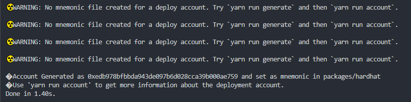
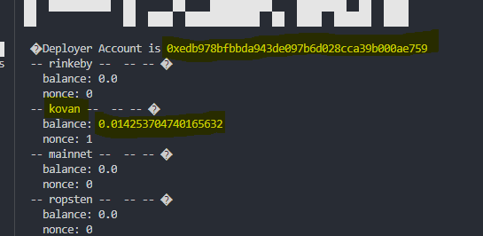
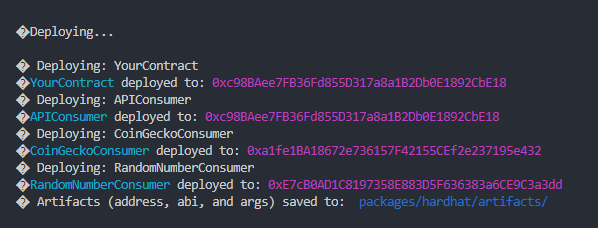
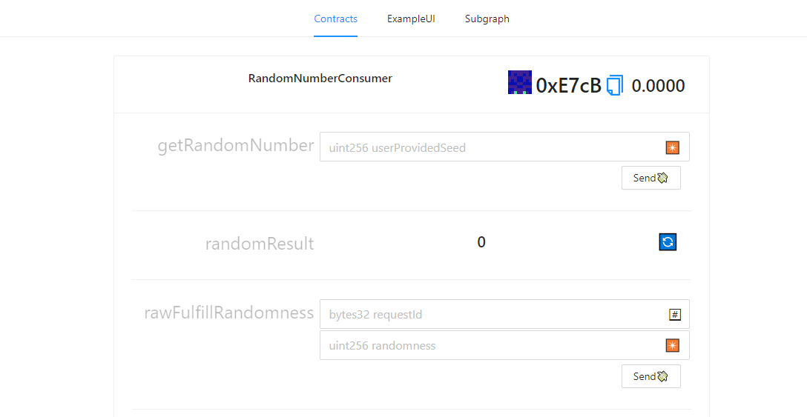

# ⛓ ChainLink

## Tutorial Info

**Author:** [pharo.eth](https://twitter.com/Pharo44153106)  
**Source code:** [https://github.com/austintgriffith/scaffold-eth/tree/chainlink-tutorial-1](https://github.com/austintgriffith/scaffold-eth/tree/chainlink-tutorial-1)  
**Intended audience:** Beginners/Intermediate  
**Topics:** Scaffold-eth basics, Chainlink, API Integration

## Getting Started & Setting Up

From a terminal or code editor of your choice start by cloning the repo.

```bash
git clone -b chainlink-tutorial-1 https://github.com/austintgriffith/scaffold-eth.git
cd scaffold-eth
```

Update all the packages.

```bash
yarn install
```

Generate a deployer account and mnemonic.

```bash
yarn run generate
```

You can ignore the warnings here.



You need to fund your account with ETH to deploy on the Kovan network. By running the following command it will show you the deployer address and the balance. 

Testnet ETH is available from:

* Kovan:  [https://faucet.kovan.network/](https://faucet.kovan.network/)
* Rinkeby: [https://faucet.rinkeby.io/](https://faucet.rinkeby.io/)

```bash
yarn run account
```



Now you are ready to deploy your contracts.

```bash
yarn deploy
```



Start the front-end application.

```bash
yarn start
```

When your application starts at http://localhost:3000 you will see your contracts interfaces. These have all been pre-added in the App.jsx file.

You still need to fund the RandomNumberConsumer contract with LINK so copy the address and send it some test LINK. 

 **Side Quest - use deploy.js to fund the contract with LINK after funding deployer account.** 

* Testnet LINK is available from [https://kovan.chain.link/](https://kovan.chain.link/)



ToDo: gather the screen shots, show how I designed a dice roll with the RNG result in solidity.


### Using an Aggregator


### Calling any API


### Using Existing Chainlink Jobs


