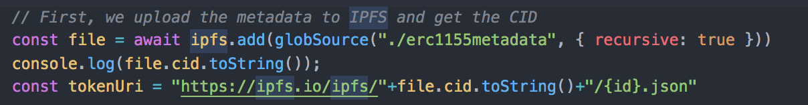
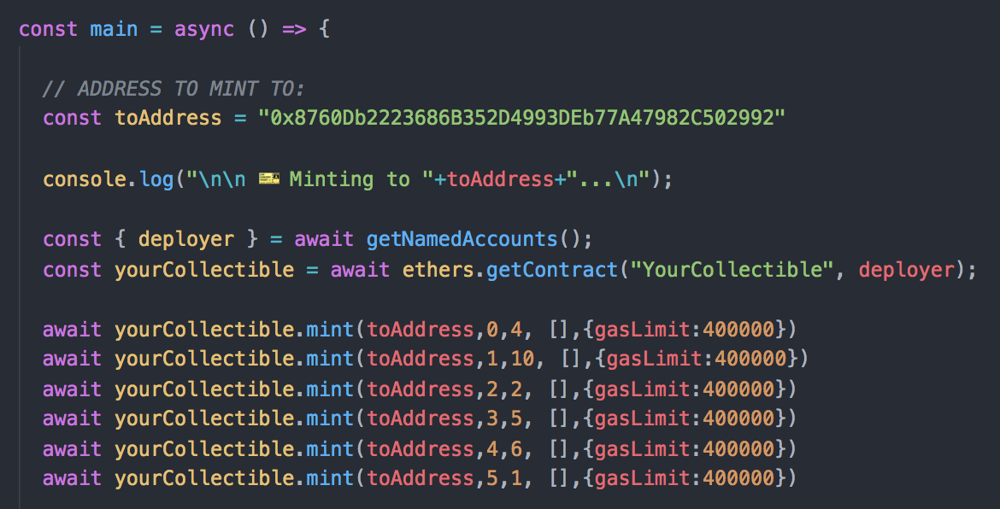
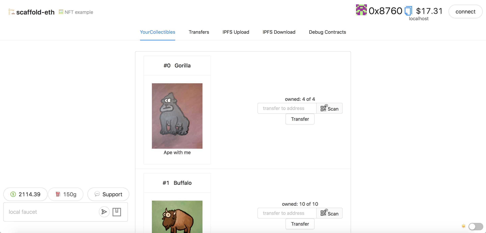
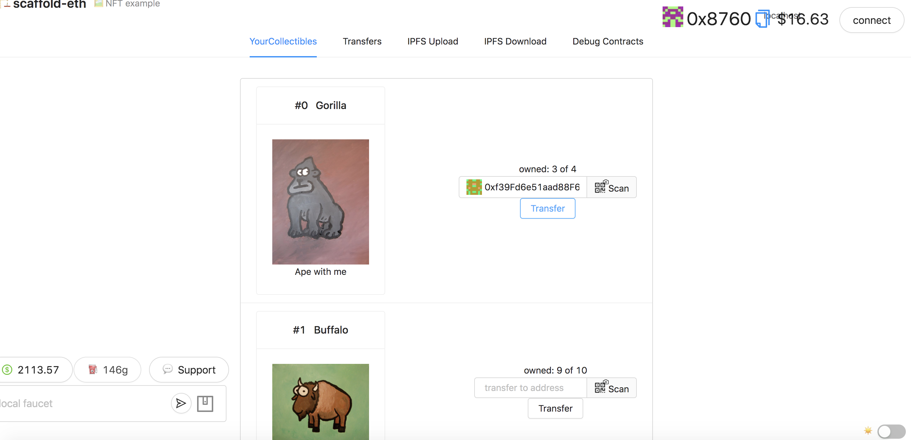
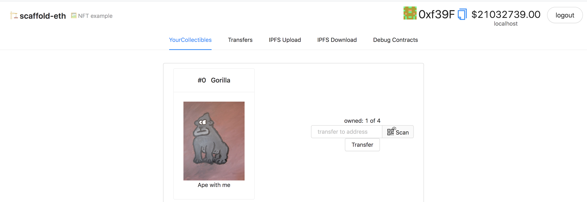

# 🎫 Simple ERC-1155 NFT

## Tutorial Info

**Author:** [Pablo Ruiz](https://github.com/pabloruiz55)  
**Source code:** [https://github.com/austintgriffith/scaffold-eth/tree/simple-nft-example](https://github.com/austintgriffith/scaffold-eth/tree/simple-erc1155-nft-example)  
**Intended audience:** Beginners/Intermediate  
**Topics:** Scaffold-eth basics, NFTs, IPFS, ERC-1155

## Introduction

This sample shows how to create a very simple ERC-1155 token, using OpenZeppelin.

## 🏃‍♀️ Quick Start


Required: [Node](https://nodejs.org/dist/latest-v12.x/) plus [Yarn](https://classic.yarnpkg.com/en/docs/install/) and [Git](https://git-scm.com/downloads)


```
git clone https://github.com/austintgriffith/scaffold-eth.git simple-erc1155-nft-example
```

```text

cd simple-erc1155-nft-example

git checkout simple-erc1155-nft-example
```

```text
yarn install
```

```text
yarn start
```

> in a second terminal window:

```text
cd simple-erc1155-nft-example
yarn chain
```

> in a third terminal window:

```text
cd simple-erc1155-nft-example
yarn deploy
```

In the deployment script \(`/packages/hardhat/deploy/00_deploy_your_contract.js`\), you will notice we are uploading the erc1155metadata folder \(in `/packages/hardhat/erc1155metadata`\) so we store the CID for the contract URI:



📱 Open [http://localhost:3000](http://localhost:3000/) to see the app

> ✏️ Edit the mint script `mint.js` in `packages/hardhat/scripts` and update the `toAddress` to your frontend address \(wallet address in the top right or localhost:3000\).



> in a terminal window run the **mint** script:

```text
yarn mint
```

👀 You should see your collectibles show up if you minted to the correct address:



👛 Open an _incognito_ window and navigate to [http://localhost:3000](http://localhost:3000/) \(You'll notice it has a new wallet address\).⛽️ Grab some gas for each account using the faucet:


🎟 Send an NFT to the _incognito_ window address:





Edit your deployment script `deploy.js` in `packages/hardhat/scripts`

🔏 Edit your smart contract `YourCollectible.sol` in `packages/hardhat/contracts`

📝 Edit your frontend `App.jsx` in `packages/react-app/src`

🔑 Create wallet links to your app with `yarn wallet` and `yarn fundedwallet`

⬇️ Installing a new package to your frontend? You need to `cd packages/react-app` and then `yarn add PACKAGE`

