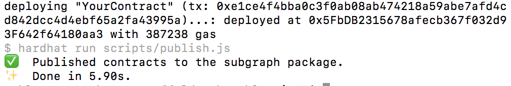
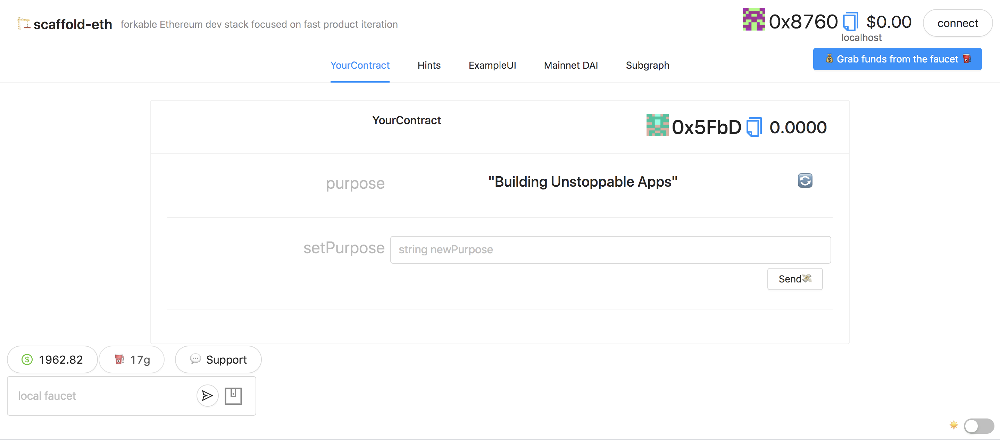
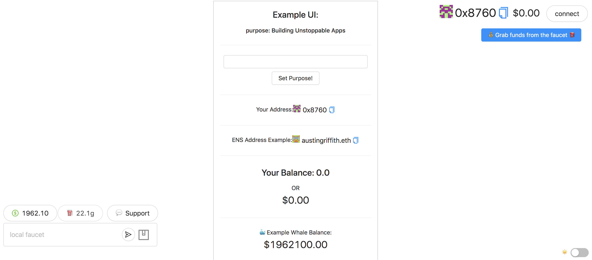
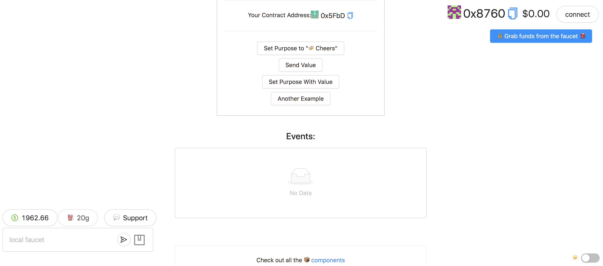
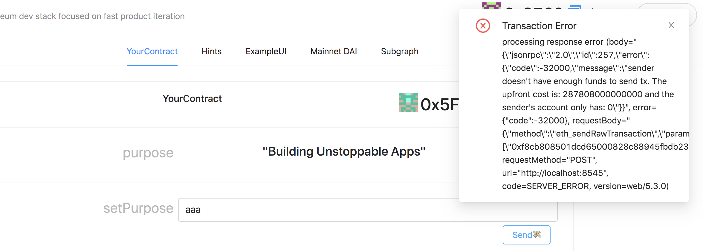
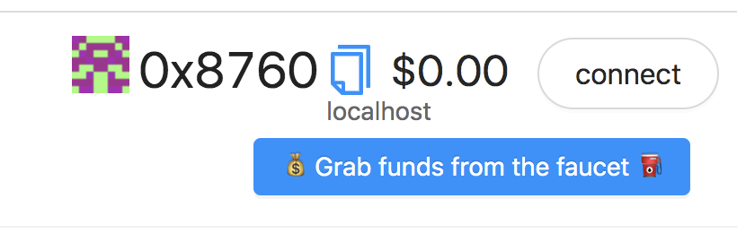
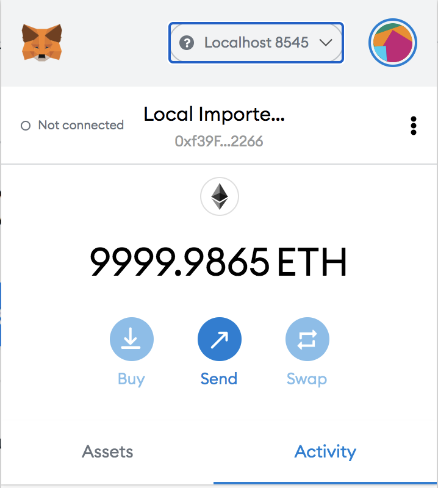

# Quick Start

Now that you have a fresh installation of Scaffold-eth, you are ready to start tinkering with it. Follow this quick start guide to get off the ground! 🚀 

## Running the starter project

Scaffold-eth comes with a small sample to help you get started and learn what features it offers. There's 3 steps you have to take to get this starter project running, which is something you will always have to do when working with Scaffold-eth \(or when building and testing any a dApp, for that matter\).

### **Step 1: Start a local network with Hardhat Network**

```text
cd scaffold-eth
yarn chain
```

### **Step 2: Deploy your contracts to the local network \(YourContract.sol\)**

> in a second terminal window:

```text
cd scaffold-eth
yarn deploy
```

### **Step 3: Run the React App to interact with the contracts deployed to your local network.**

> in a third terminal window:

```text
cd scaffold-eth
yarn start
```

In your browser, open [http://localhost:3000/](http://localhost:3000/) to start playing around with it.

## What did we do just now?

Read along if you want to know more about what we did just now. 

### 1. Start a local network

Scaffold-eth ships with Hardhat, which as of the date of this writing, it has become development the de facto environment to compile, deploy, test, and debug Ethereum software.

Hardhat comes built-in with Hardhat Network, a local Ethereum network designed for development. 


If you've done Solidity development in the past, Hardhat Network works very similarly to [Ganache](https://www.trufflesuite.com/ganache).


Let's begin by running our local network by running the following command on a new terminal window \(you should always run these commands from the scaffold-eth root folder\).

```text
cd scaffold-eth
yarn chain
```

You should see something like this:


**Congratulations! You now have a local blockchain running on your computer.** 


By default Hardhat Network starts with 20 accounts with 10,000 ETH each, generated with the mnemonic: `test test test test test test test test test test test junk`


### 2. Deploy your first smart contract

Now that we have our local network running, we can deploy smart contracts to it. Run the following command in a _**new**_ terminal window.

```text
cd scaffold-eth
yarn deploy
```

You should see something like this:



You can find the smart contract this command deployed in `/packages/hardhat/contracts/` . When you run this command, Hardhat runs the `deploy` command, which looks at the `./deploy` folder for the scripts instructing which contracts to deploy. In this case, we have the `00_deploy_your_contract.js` script that tells Hardhat how to deploy the `YourContract.sol` contract.

### 3. Launch the web app

Now that we have a local network running and our smart contract deployed to it, it's time to see it working. 

Scaffold-eth comes with React and offers a lot of helper components and hooks to make it very easy to connect to a network and start interacting with your smart contracts right away. 

In order to see and interact with the smart contract we just deployed to the Hardhat Network, run the following command in _**yet another new**_ terminal window.

```text
cd scaffold-eth
yarn start
```

Once the development server starts and your app is done compiling it should be running in https://localhost:3000 and if you open that url on your browser, you should see the following:



The starter project comes with a few pre-made views, but the ones you should focus on for now are the YourContract section and the ExampleUI section which showcase the two ways you can work with Scaffold-eth to build UIs.

**The YourContract section** is using one of the many handy React components Scaffold-eth offers, the `<Contract />` component, which given a contract name you have compiled, it will parse it and create a UI for it exposing all the public variables and methods it has. This is very useful when you want to quickly test your contracts but offers no flexibility in terms of good UX.

In this case, `YourContract.sol` has a `purpose` public string which anyone can change by calling `setPurpose(string)`. 

**The ExampleUI section** showcases how to build a custom UI around your contract, using many of the different components and hooks Scaffold-eth ships with. 







Congratulations! You now have a running dApp running locally which can interact with your deployed smart contract. 


### Interacting with your app and contracts

If this is your first time with Scaffold-eth and/or Ethereum development, you might have notices that if you want to actually interact with your contract by changing the `purpose` via `setPurpose(string)` you are getting an error like this:



The reason why you are getting that error is because the account you are "logged" with actually doesn't have any ether to pay for gas. But don't worry, there's a few ways to easily fix that.

#### Burner Wallets

By default, Scaffold-eth ships with an implementation of burner wallets. You will notice when you start the app that it shows you the account it's currently logged with at the top right of the screen. This comes very handy for quickly iterating as you don't need to use Metamask or some other web3 provider to work with. 



And if you you are working on a local network you can quickly get some ether to work with by pressing the blue button above.

#### Hardhat accounts and Metamask

If you remember, when we ran `yarn chain` to launch Hardhat Network, we saw that by default it always uses the same seed phrase. We can use that seed phrase to load those accounts on Metamask. In order to do that, just import the seed phrase / mnemonic in Metamask and configure it so it can connect to the local network you are running.




DO NOT USE THESE ACCOUNTS ON MAINNET. Everyone reading this or the Hardhat docs has access to these accounts.


## Next Steps

In this guide we covered the following topics:

* Starting a local development network with Hardhat Network
* Deploying smart contracts to that network using Hardhat deploy command
* Starting a local server with React and interacting with our smart contract.

Now that we covered the basics of Scaffold-eth, you should try to familiarize yourself with Solidity and the deployment process, as well as with the different components and hooks Scaffold-eth offers. **Here are some ideas:**

* 🔐 Edit your smart contract `YourContract.sol` in `packages/hardhat/contracts`
* 📝 Edit your frontend `App.jsx` in `packages/react-app/src`
* 💼 Edit and add your deployment scripts in `packages/hardhat/deploy` - we are using [hardhat-deploy](https://www.npmjs.com/package/hardhat-deploy)
* ✏ Make small changes to `YourContract.sol` and watch your app auto update!
* 🔁 You can `yarn deploy` any time and get a fresh new contract in the frontend
* 👷 Look for the [HardHat](https://hardhat.org/) console.log\(\) output in the `yarn chain` terminal
* ⚗ Spend some time tinkering with `YourContract.sol`


Don't forget to check the [Examples and Tutorials](../examples-and-tutorials/overview.md) section which has a bunch of tutorials and sample projects built with Scaffold-eth which you can extend or use as a base for your own projects!


