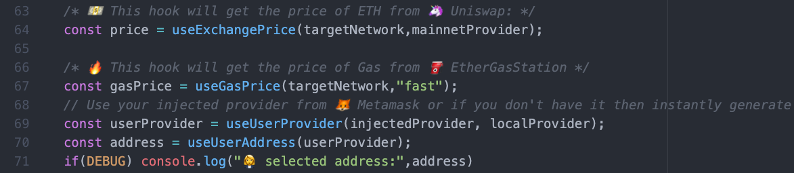

# Hooks



Commonly used Ethereum hooks are located in `packages/react-app/src/`:

## usePoller

`usePoller(fn, delay)`: runs a function on app load and then on a custom interval

```text
usePoller(() => {
  //do something cool at start and then every three seconds
}, 3000);
```

## useOnBlock

`useOnBlock(provider, fn, args)`: runs a function on app load and then on every new block for a provider

```text
useOnBlock(mainnetProvider, () => {
  console.log(`⛓ A new mainnet block is here!`);
});
```

## useUserSigner

`useUserSigner(injectedProviderOrSigner, localProvider)`: returns the signer associated with an injected web3 provider; if injectedProvider is null, generates a burner signer \(stored in local storage\)

```text
const userSigner = useUserSigner(injectedProvider, localProvider);
```

## useBalance

`useBalance(address, provider, [pollTime])`: poll for the balance of an address from a provider

```text
const localBalance = useBalance(address, localProvider);
```

## useBlockNumber

`useBlockNumber(provider,[pollTime])`: get current block number from a provider

```text
const blockNumber = useBlockNumber(props.provider);
```

## useGasPrice

`useGasPrice([speed])`: gets current "fast" price from [ethgasstation](https://ethgasstation.info/)

```text
const gasPrice = useGasPrice();
```

## useExchangePrice

`useExchangePrice(mainnetProvider, [pollTime])`: gets current price of Ethereum on the Uniswap exchange

```text
const price = useExchangePrice(mainnetProvider);
```

## useContractLoader

`useContractLoader(provider)`: loads your smart contract interface, for contracts on the provider's chain.

This will use contracts deployed from `packages/hardhat` \(which are exported to `src/contracts/hardhat_contracts.json`\), as well as external contract information, which can be added to `src/contracts/external_contracts.js`. Note that you can override both of these by passing `hardhatContracts` or `externalContracts` to the second config parameter of `useContractLoader` \(see those files for the required format\).

```text
const readContracts = useContractLoader(localProvider);
const writeContracts = useContractLoader(injectedProvider);
const writeContracts = useContractLoader(injectedProvider, { chainId: 1 }); // fix the chainId (even if the provider is on a different chain)
const writeContracts = useContractLoader(injectedProvider, {
  networkName: "localhost",
}); // fix the hardhat network name (even if the provider is on a different chain)
const writeContracts = useContractLoader(injectedProvider, {
  customAddresses: { EXAMPLE: "0xADDRESS" },
}); // over-ride the address

// Pass custom contracts
const ERC20ABI = [
  "function balanceOf(address owner) view returns (uint256)",
  "function decimals() view returns (uint8)",
  "function symbol() view returns (string)",
  "function transfer(address to, uint amount) returns (boolean)",
  "event Transfer(address indexed from, address indexed to, uint amount)",
];
const ERC20ContractMetadata = {
  1: {
    contracts: {
      DAI: {
        address: "0x6B175474E89094C44Da98b954EedeAC495271d0F",
        abi: ERC20ABI,
      },
      UNI: {
        address: "0x1f9840a85d5aF5bf1D1762F925BDADdC4201F984",
        abi: ERC20ABI,
      },
    },
  },
};

const writeContracts = useContractLoader(injectedProvider, { chainId: 1
  externalContracts: ERC20ContractMetadata,
});
```

## useContractReader

`useContractReader(contracts, contractName, variableName, [pollTime])`: reads a variable from your contract and keeps it in the state

```text
const title = useContractReader(props.readContracts, contractName, "title");
const owner = useContractReader(props.readContracts, contractName, "owner");
```

## useEventListener

`useEventListener(contracts, contractName, eventName, [provider], [startBlock])`: listens for events from a smart contract and keeps them in the state

```text
const ownerUpdates = useEventListener(
  readContracts,
  contractName,
  "UpdateOwner",
  props.localProvider,
  1
);
```

