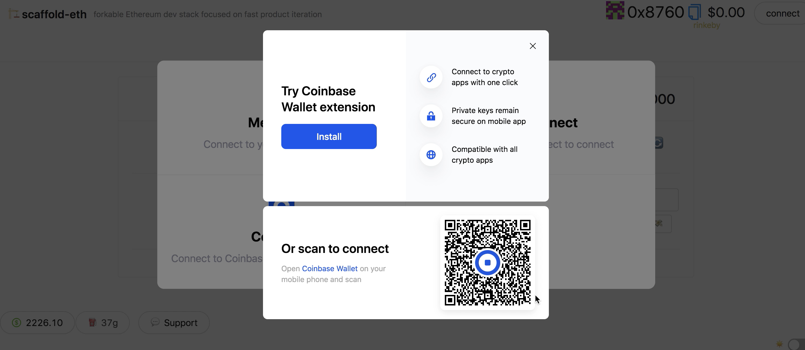

# Providers & Signers

## Providers

Providers are your connections to different blockchains. Scaffold-eth uses [ethers.js providers](https://docs.ethers.io/v5/api/providers/).

The frontend has three different providers that provide different levels of access to different chains:

**`mainnetProvider`**: \(read only\) [Alchemy](https://alchemyapi.io/) or [Infura](https://infura.io/) connection to main [Ethereum](https://ethereum.org/developers/) network \(and contracts already deployed like [DAI](https://etherscan.io/address/0x6b175474e89094c44da98b954eedeac495271d0f#code) or [Uniswap](https://etherscan.io/address/0x2a1530c4c41db0b0b2bb646cb5eb1a67b7158667)\).

**`localProvider`**: local [HardHat](https://hardhat.org/) accounts, used to read from _your_ contracts \(`.env` file points you at testnet or mainnet\). We use `ethers.providers.StaticJsonRpcProvider` when instantiating providers from RPCs where we are confident that the chainId won't change to save on network calls :\)

**`injectedProvider`**: your personal [MetaMask](https://metamask.io/download.html), [WalletConnect](https://walletconnect.org/apps) via [Argent](https://www.argent.xyz/), connected using [web3modal](https://github.com/Web3Modal/web3modal).

## Signers

From the [ethers.js docs.](https://docs.ethers.io/v5/api/signer/)

> A Signer in ethers is an abstraction of an Ethereum Account, which can be used to sign messages and transactions and send signed transactions to the Ethereum Network to execute state changing operations.

Scaffold-eth now uses signers for user operations, either using `injectedProvider.getSigner()`, or using a Burner Signer created and stored in localStorage \(all handled by the `useUserSigner` hook!\)


#### When should I use a provider and when should I use a signer?

If you are only reading data, use a provider. If you need to make transactions, or sign things, use a Signer.


## Supported Web3 Signers / Providers

### Ethers

### Metamask

### WalletConnect

### Coinbase Wallet

Scaffold-eth supports connecting with Coinbase Wallet and signing transactions with it.

See it in action here:



