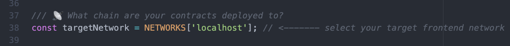

# Overview

Scaffold-eth uses React for the frontend. You can learn more about React here: [https://reactjs.org/](https://reactjs.org/)

## Editing your frontend

#### Edit your frontend here: `App.jsx` in `packages/react-app/src`

📡 Make sure your `targetNetwork` is the same as 👷 HardHat's `defaultNetwork` \(where you deployed your contracts\):

🤡 Adjust your debugging settings as needed:

