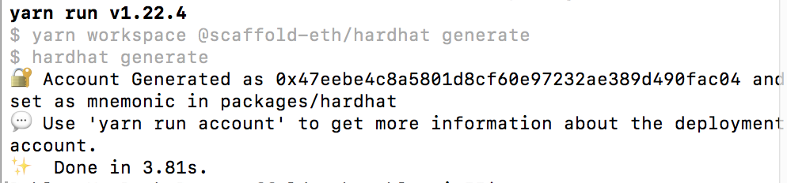

# Deploying your contracts

Once you are ready to deploy your contracts to a testnet or mainnet there's a few things you need to addjust.

## Step 1: Select the network

You can change the `defaultNetwork` in `packages/hardhat/hardhat.config.js`

Scaffold-eth already comes with a preset of networks to choose from but you can also add your own if it's missing from the networks list.


The networks list have a hardcoded Infura key. Make sure sure to change it to your own as there's no guarantee the one it's using will still work.


## Step 2: Generate a deployer account

The deployer account is the account that will run the deploy scripts, so it's the one that will actually deploy your contracts and execute any further calls you make in your deployment script. I.E: it will end up being the owner of the contracts you deploy if there's such a construct in your contracts.


If you don't change anything the deployer account will be the one that comes by default with Hardhat, **which pretty much anyone can access.**


In order to change it, you can run `yarn generate` which will create a seed phrase for you. You should see the following output:



And the mnemonic.txt file which contains the seed phrase for the account that was created.


You can run `yarn account` to see details of this account like eth balances accross different networks.


Make sure the mnemonic.txt file as well as the \[account\].txt files are safely guarded and are not being committed to git for example.



If you don't trust Hardhat with the generation of this seed phrase, you can do it with your preferred seed phrase generation method and then create the mnemonic.txt yourself with the seed phrase in it.


Once you have your account loaded up, you will need to fund it to pay for the gas costs associated with deploying the contracts and executing any other deployment functions you have in your scripts.


Pro tip: use an [instant wallet](https://instantwallet.io/) to send funds to the QR code from `yarn account`


## Step 3: Deploy your contract\(s\):

```text
yarn deploy
```

### hardhat-deploy

Scaffold-eth now uses [hardhat-deploy](https://www.npmjs.com/package/hardhat-deploy), a hardhat plugin by [wighawag](https://twitter.com/wighawag?lang=en) that gives your hardhat deployments super-powers!

When you run `yarn deploy`, the scripts in `/packages/hardhat/deploy` are run in alphabetical order \(by default - more fine-grained controls in the hardhat-deploy docs\). You can deploy contracts, interact with contracts & send ETH - whatever you want!

Deployment metadata is stored in the `/deployments` folder, and automatically copied to `/packages/react-app/src/contracts/hardhat_contracts.json` via the `--export-all` flag in the `yarn deploy` command \(see `/packages/hardhat/packagen.json`\).

Crucially, this information is stored by network, so if you redeploy contracts on a new network \(e.g. on testnet, after running locally\), your local deployments are still tracked.

