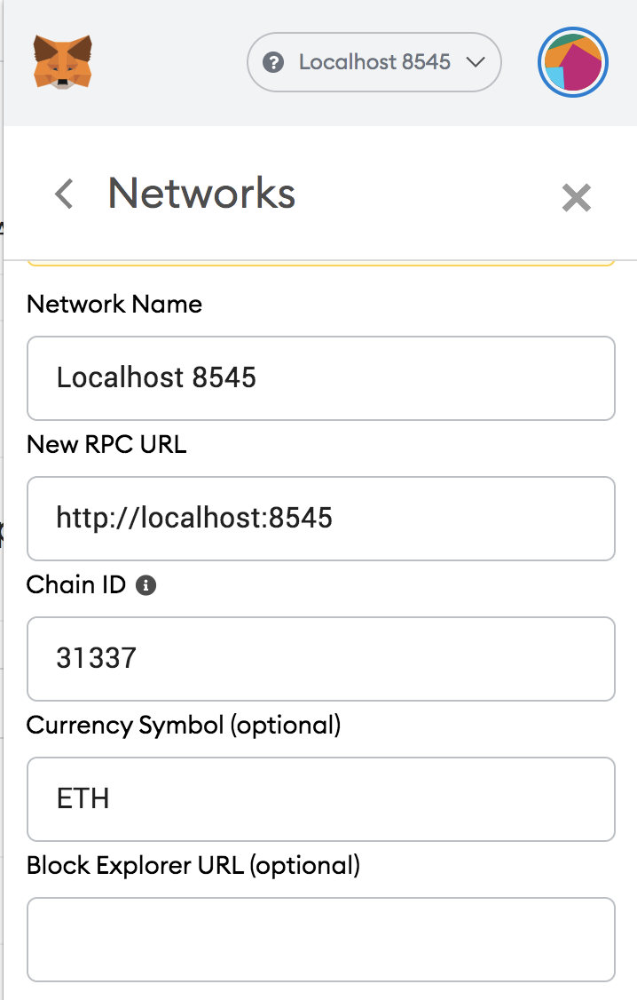

# Troubleshooting

## Metamask ChainId error when connecting to localhost 

In order for Metamask to work with Hardhat Network it must connect to port 8545 and the ChainId must be 31337. Configure the network on Metamask by going to Settings-&gt; Networks.

## Metamask nonce error

Sometimes Metamask will get confused when switching networks or restarting your local network. If that happens, Metamask will use an incorrect nonce when submitting a transaction to your local network. I.E: Metamask might think this is the 4th tx on the local network but you just restarted it and it's expecting a nonce of 1.

You can fix this by either enabling entering custom nonce on Metamask by going to Settings-&gt; Advanced-&gt; Customize transaction nonce.

Or by reseting your account on Metamask by Settings-&gt; Advanced-&gt; Reset Account.

